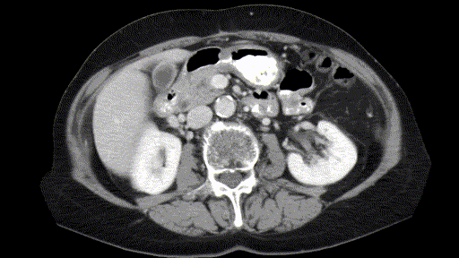

# IMVS: Interactive Medical Volume Segmentation with Test-Time Adaptation - A New Method for Annotating Radiology Datasets

**HAIC Workshop, MICCAI 2026** · [Paper (arXiv:2609.16775)](https://arxiv.org/abs/2609.16775) · [Demo video](https://www.youtube.com/watch?v=4R_ChB12o-c)



> **Status: code preview.** The runnable release is planned for **October 31**. It will include:
> a one-line install in a container, weights on Hugging Face, ONNX and TensorRT conversion
> scripts, and a one-command evaluation on your own volumes.
>
> **Get notified:** click **Watch → Custom → Releases** on this repo, or [leave your email](https://forms.gle/wY7hx3hnFRfwNbih8).
> **Tell us what you'd annotate:** [issue #2](https://github.com/AbhilakshSinghReen/imvs/issues/2).
> We'll prioritise the modalities and structures people ask for.

## What it does

Annotating a CT or MRI volume slice by slice means correcting the same error again and again. IMVS turns each correction into two things: a fix for the slices ahead, and a training signal.

- **Slice Mask Adapter (SMA).** A small 2D network (UNet++ by default) that takes your scribbles as input and is fine-tuned online from each correction.
- **Volume Mask Tracker (VMT).** A frozen propagator that carries the accepted mask across adjacent slices, using long- and short-term attention over a memory bank.
- **Soft teacher–student alignment.** Keeps the adapted model anchored to a frozen teacher so it doesn't forget.

The design choice that matters: the propagator stays **frozen**, and only the small 2D model adapts. In our ablation, adapting the tracker too gave no accuracy gain at 6× the VRAM and 14× the latency. Online adaptation of the 2D model cuts the number of corrections from ** 18 to 4**.

## Current limitations

- One target per pass. For several structures, run one session per structure.
- Evaluated on CT and MRI only.
- Research use only. Not a medical device.

## Code in this preview

- `model/`: IMVS inference engine (SMA, VMT, adaptation loop)
- `api/`: API server used by the 3D Slicer extension

This preview is **not yet installable**. Please wait for the release rather than installing from `model/requirements.txt`.

## Citation

```bibtex
@article{reen2026imvs,
  title   = {IMVS: Interactive Medical Volume Segmentation with Test-Time Adaptation - A New Method for Annotating Radiology Datasets},
  author  = {Reen, Abhilaksh Singh and Borkar, Kushal and Mahapatra, Ritvik},
  journal = {arXiv preprint arXiv:2609.16775},
  year    = {2026},
  note    = {Accepted at the HAIC Workshop, MICCAI 2026}
}
```

## Related work and acknowledgements

- **Our earlier work.** Kushal Borkar, Abhilaksh Singh Reen, C.V. Jawahar, Chetan Arora, _No Prompting Frozen Foundation Models: Interactive Medical Volume Segmentation using Continual Test Time Adaptation of Compact Models_, ACM ICVGIP 2024 [Paper](https://dl.acm.org/doi/10.1145/3702250.3702275).
- **Baselines** compared in the paper: f-BRS, MedSAM, MedSAM2, ScribblePrompt, iSegFormer, PRISM, and nnInteractive.

## License

- **Code:** Apache-2.0 (see `LICENSE`). Third-party notices, including AOT (BSD-3-Clause), are in `THIRD_PARTY_NOTICES` once the VMT code is added.
- **Model weights** (when released): CC BY-NC-SA 4.0, for non-commercial research use. Two of the training datasets (LiTS, BraTS) are licensed for non-commercial research only.

## Contact

Abhilaksh Singh Reen · abhilakshsinghreen@gmail.com

Questions and bug reports: [GitHub issues](https://github.com/AbhilakshSinghReen/imvs/issues)
